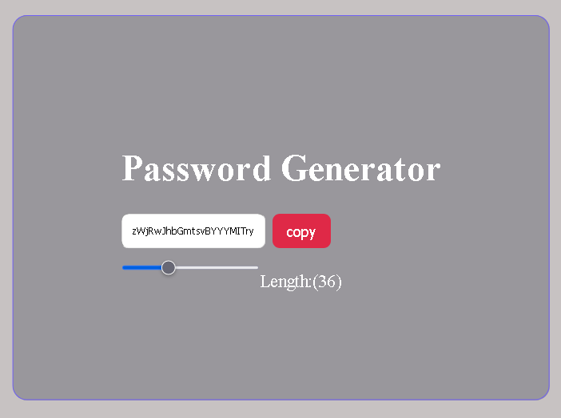

# Random Password Generator

A Simple Random Password Generator Webpage built with  React.js.

## Features

- Generate Random Password with Length Should be minimum 6 words to maximum 100

- Also you can copy the generated Password and paste it any where

- Customize the Password Length

## Screenshots

## Getting Started

 Follow these instructions to get a copy of the project up and running on your local machine.

### Prerequisites

 - [Node.js ](https://nodejs.org/en)
 - [React.js](https://react.dev)
 - That two Application Must Be Installed in your System Before Starting The Application

 ### Installing
 1. Clone the repository:

 git clone https://github.com/your-username/Password_Generator.git

### Install dependencies:

- Node Module Folder Was Created
npm install

### Run the App :

npm run dev

### Author

Shubham Singh